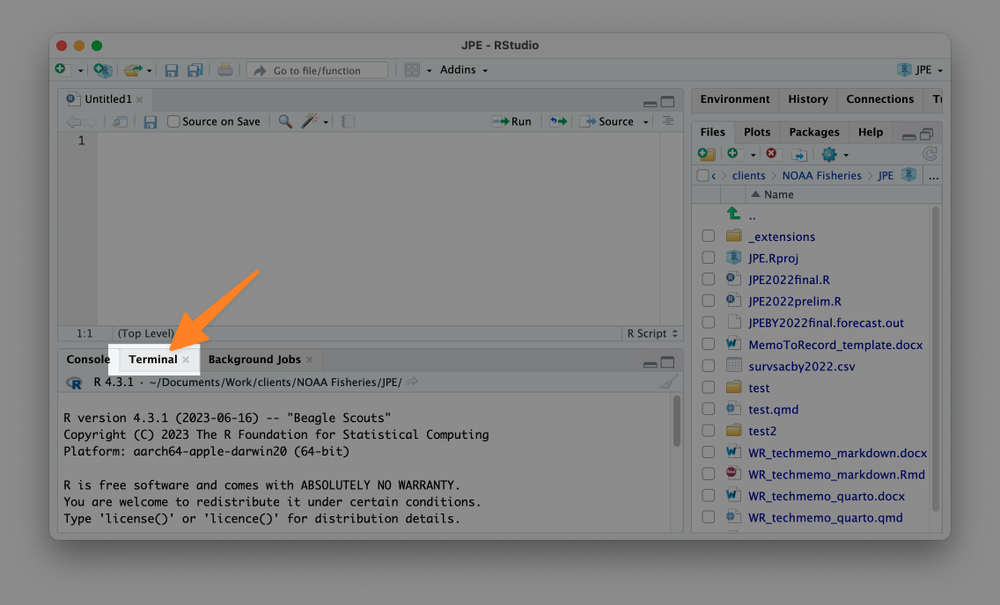

# NOAA Fisheries Memo to Record

This is a template for a NOAA Fisheries Memo to Record in Quarto. 

To generate a new Memo to Record Quarto file, first make sure you are working in an RStudio project. 

Next, identify your terminal:



Then, click terminal and run this command at the prompt:
 
```bash
quarto use template rfortherestofus/noaa-fisheries-memo-to-record
```
This will install the extension. You will be asked whether you trust the authors of the template. Type Y and hit enter.

```bash
? Do you trust the authors of this template (Y/n)
```

Next, you will be asked to create a directory where your new Quarto file will be placed. Type a name and hit enter.

```bash
? Directory name: › 
```

The Quarto template will be installed, at which point you can go into the directory you created and find a Quarto file that you can use as a starting place for your memo. 

You can add any content you want to this Quarto file before rendering it, which will create a Word document that you can then edit as you see fit. You can also move the Quarto file that was created to a different location you want (e.g. not in a separate directory).

You can also create new Quarto files in the same RStudio project. To do so, just create a new Quarto file and then replace the default YAML with this:

```yaml
---
format:
  noaa-fisheries-memo-to-record-docx: default
---
```

From there, add any content and render and your Word document will follow the template.